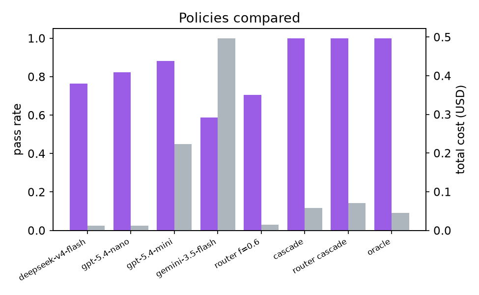

# Learning to Route: Static Embedding Models as Self Improving LLM Routers for Coding Tasks

**Lee Penkman**
lee.penkman@gmail.com · [openpaths.io](https://openpaths.io) · [github.com/lee101/learning-to-route](https://github.com/lee101/learning-to-route) · [huggingface.co/openpaths/learning-to-route](https://huggingface.co/openpaths/learning-to-route)

*Draft v0.2, July 2026*

## Abstract

Frontier coding models cost 5x to 55x more per token than small models that solve most real coding tasks just as well. GPT-5.6 Sol is $5.00 per million input tokens while DeepSeek V4 Flash is $0.14 official and $0.09 spot. Routing each task to the cheapest model that can solve it is therefore one of the largest levers left on serving cost, and it needs no model training at all. This paper describes a router where routing is literally embedding search. A task is embedded by a static embedding model, which is a token table lookup and a mean pool with no transformer forward pass, about 0.15 milliseconds on CPU from a 16 MB file. The k nearest previously seen tasks then vote on which model to use, weighted by their observed pass rates. Because the router state is just vectors plus outcome counters, it learns online: every completed agent task folds its result back into the nearest anchor, so the task to model map improves continuously from live traffic with no training loop. On a 17 problem medium to hard coding benchmark built for this paper, a verify and escalate cascade over four cheap models solves 100% of tasks at 26% of the cost of the best single model, which only solves 88%. The entire experimental run cost under one dollar of API credit. The router, benchmark, paper and serving code in Python, Go and Zig are all MIT licensed and deployed against the production router at openpaths.io.


## 1. Introduction

The biggest waste in agentic coding is not failing hard tasks. It is sending easy tasks to expensive models. A production gateway sees the same shapes of work all day: fix an off by one, write a parser, resolve a merge conflict, add a test. A $0.14 per million model and a $5.00 per million model solve most of these identically. A minority genuinely need the frontier tier, and you usually cannot tell which from a price list.

OpenAI made the tradeoff explicit in July 2026 by shipping price tiers as a product. GPT-5.6 comes as Sol ($5.00/$30.00 per million tokens in/out), Terra ($2.50/$15.00) and Luna ($1.00/$6.00). Anthropic's Claude Fable 5 sits at a similar frontier price point. That is a 5x spread inside one model family and roughly 55x against spot priced small models. Whoever picks the right point on that curve per task, rather than per month, keeps frontier quality while paying small model prices.

Existing routers train a classifier (RouteLLM's BERT router, Arch-Router's 1.5B generative router, Supra-Router-51M's micro LLM), call a commercial black box (Martian, NotDiamond), or hand write rules. Three observations suggest something simpler:

1. Nearest neighbour routing is strong. Recent work shows plain kNN over sentence embeddings matches or beats learned matrix factorization and MLP routers (arXiv:2505.12601). Similar tasks want the same model, and kNN needs very few samples to see that.
2. Embedding can be nearly free. Static embedding models run 100x to 400x faster than transformer encoders on CPU while keeping about 87% to 95% of retrieval quality. Embedding a task is a memory read.
3. Coding agents produce labels for free. Every agent run ends in a verifiable outcome (tests pass, patch applies) with a known cost and latency. That is exactly the supervision a router needs, delivered continuously.

So the router in this paper is an ANN index over past tasks, updated online from agent outcomes, queried with a static embedder. There is no training loop and no inference server. It runs inside a gateway hot path, inside a CLI agent, or on device. The same pattern already powers the auto router inside [openpaths.io](https://openpaths.io), where prompts are matched against a table of task descriptions to pick a model and a reasoning effort. This paper replaces the curated table with a learned, self updating one, and everything found here deploys straight back into that production router.

## 2. Related Work

RouteLLM (arXiv:2406.18665) trains routers on 55k Chatbot Arena preference pairs and cuts cost over 85% on MT-Bench at 95% of GPT-4 quality. FrugalGPT (arXiv:2305.05176) cascades models with a stopping judge and reports up to 98% cost reduction at matched quality. Hybrid LLM (arXiv:2404.14618) trains a difficulty predictor for two model routing, and BEST-Route (arXiv:2506.22716) adds best of n sampling on the small model for up to 60% cost cut with under 1% quality drop. Arch-Router (arXiv:2506.16655) maps queries to human defined policies with a 1.5B model at about 50 ms per decision. Supra-Router-51M is a 51.7M parameter Llama architecture micro LLM fine tuned on 992 samples that emits a structured analysis string ending in a route token. It is the smallest generative router design point we know of, though it publishes no quantitative evaluation and no license, which limits what can be built on it. Commercial routers (Martian, NotDiamond, which powers OpenRouter auto) claim 20% to 97% cost reductions at matched quality.

RouterBench (arXiv:2403.12031) releases 405k precomputed generations from 11 models so routers can be evaluated offline, and its strongest simple baseline is cosine kNN over MiniLM embeddings. The kNN result was sharpened by arXiv:2505.12601, which finds plain kNN beats learned routers across routing benchmarks. This paper leans on that finding and pushes it further in two directions: the embedder shrinks from a transformer to a static lookup table, which is two to three orders of magnitude cheaper, and the anchor table becomes online, updated per outcome rather than fit offline.

On the embedding side, the Hugging Face static embedding recipe (static-retrieval-mrl-en-v1) trains a bare token embedding matrix with contrastive loss and reports 100x to 400x CPU speedups at 87.4% of the retrieval quality of all-mpnet-base-v2, with Matryoshka truncation to smaller dimensions costing under 1%. Model2Vec and the potion models get similar results by distillation. My own recipe for distilling a static model from ModernBERT is public at [lee101/public-static-modern-bert](https://github.com/lee101/public-static-modern-bert) and is reported there honestly as a partial negative result: single dataset distillation did not beat the multi dataset baseline on BEIR. That is exactly why this paper uses the off the shelf static-retrieval-mrl-en-v1 weights, quantized to int8 at 512 dimensions (about 16 MB), rather than a custom embedder.

For serving, CAGRA (arXiv:2308.15136, NVIDIA cuVS) builds fixed degree proximity graphs on GPU and searches 33x to 77x faster than CPU HNSW at 90% to 95% recall, with a build on GPU serve on CPU export path. The anchor tables in this paper are small enough for exact search, but the graph path matters because a production table grows without bound from agent traffic. The three companion libraries, [gobed](https://github.com/lee101/gobed) (Go), [zbed](https://github.com/lee101/zbed) (Zig) and [pybed](https://github.com/lee101/pybed) (Python), all serve the same int8 static model with flat and CAGRA style graph indexes, which is what makes the router portable across languages.

## 3. Method

### 3.1 Routing as embedding search

Let E map text to a unit vector in R^512 via the static embedder. The router state is a set of anchors. Each anchor holds a vector for a previously seen task and, per model, an observation count n, an exponentially weighted pass rate p, and an average cost. To route a new task, retrieve its k nearest anchors by cosine similarity and estimate each model's pass probability as a similarity and evidence weighted average with a weak prior:

```
p_m(t) = ( p0 * n0 + sum_i w_i * p_i,m ) / ( n0 + sum_i w_i )
w_i    = max(cos(v_i, E(t)), 0) * min(n_i,m, 10)
```

The prior (p0 = 0.5, n0 = 1) keeps estimates near 0.5 where evidence is thin, and the cap stops any single anchor from dominating.

### 3.2 Cost aware decision rule

Models are sorted by expected request cost. The router picks the cheapest model whose estimated pass probability clears a floor tau (default 0.6). If nothing clears the floor it maximizes p_m minus a small cost penalty, which means escalate toward quality but stay price aware. Tau is the one product knob: raise it to trade money for reliability. When the deployment can verify results and retry (the normal agentic coding case), tau can sit low because failures are caught by tests rather than shipped, and section 5 shows this cascade mode is where the method shines.

### 3.3 Online learning from agent outcomes

When a routed task finishes, the agent reports the task text, the model, whether it passed, and what it cost. If the nearest anchor is very close (cosine at least 0.92) the observation folds into it. Otherwise the task becomes a new anchor. This update rule gives the router properties trained routers do not have:

- New models join the fleet with just a price and a prior, and acquire an empirical footprint as traffic touches them. There is no retraining event. This is what makes the July 2026 model churn manageable: when GPT-5.6 Luna appeared it could start receiving exploratory traffic the same day.
- When a provider silently improves or degrades a model, the moving average follows within a handful of observations.
- Two deployments specialize differently. An agent fleet on a Go monorepo and one on data science notebooks converge to different tables from the same code.
- The map is inspectable. Every routing decision can be explained by showing the neighbor tasks that voted and their pass rates.

### 3.4 The router is an index

Router state serializes to JSON as (text, vector, stats) triples. Anything that can run the same static embedder and a cosine top k can serve it. The repo ships working examples for pybed (pure Python, flat and CAGRA style graph indexes, optional CUDA kernels, 0.34 ms per query over 20k documents on an RTX 5090), gobed (Go, 0.15 ms per embed) and zbed (Zig, SIMD). The model file is 16 MB and a big anchor table is megabytes, so the whole router fits inside an agent binary, a gateway, or an edge worker. Routing overhead is microseconds against LLM calls that take seconds.

### 3.5 Routing as an intelligence lerp

A useful way to think about what the router does: it linearly interpolates intelligence per request. Model families now expose a price and capability dial with discrete stops, Luna, Terra, Sol on the OpenAI side, Haiku, Sonnet, Opus and now Fable on the Anthropic side, plus a long tail of small open models below them. A fixed choice pins every request to one stop. The router turns the discrete tiers into a continuous curve: easy requests resolve at the cheap end, hard ones at the frontier end, and the blend point per task is learned from outcomes rather than guessed. The aggregate effect is a deployment that sits between tiers, for example 95% of Sol quality at closer to Luna prices.

This is also why the method scales to bigger models without any changes. Adding GPT-5.6 Sol or Claude Fable 5 to the fleet is one price entry and a prior. The anchors and the embedder do not care how large the target model is, they only track who solves what for how much. As frontier models improve, the router shifts traffic toward whichever tier newly dominates its price point, which means users of a routed endpoint track the moving intelligence frontier automatically instead of re benchmarking and re configuring every launch week. That is the product we run at openpaths.io, and the improvements measured in this paper deploy directly into its auto router.

## 4. Benchmark

Public coding benchmarks are either saturated by cheap models (frontier models exceed 90% on HumanEval+ and MBPP+) or too expensive to rerun per router iteration (SWE-bench). Router research needs tasks where cheap models fail at meaningfully different rates, cheaply. So the repo includes 17 self contained Python tasks, medium to hard, each with adversarial hidden tests run in an isolated interpreter (python -I, 15 second timeout):

- Stateful data structures: an LRU cache with TTL and interacting eviction rules, a wildcard trie, a consistent hash ring that must match an exact md5 point spec.
- Parsers and matchers: RFC 4180 CSV without the csv module, path globbing with ** semantics, a small regex engine, an arithmetic expression evaluator with Python floor semantics and no eval.
- Algorithms: lexicographically smallest topological sort, cheapest path with a stop budget, interval set operations, minimal LCS diff scripts verified against a DP oracle.
- Systems semantics: a sliding window rate limiter with half open windows, a parallel task scheduler, an idempotent transaction ledger with ordered rejections.
- Codecs and resolvers: base62 with leading zero preservation, semver range resolution including caret on 0.x, JSON path lookup.

The hidden tests were themselves validated by writing reference solutions for the five most spec heavy tasks, and two test bugs found this way were fixed before any numbers were recorded. Tasks are prompt only, graded pass or fail, and a full four model sweep costs about 25 cents. The harness targets any OpenAI compatible endpoint and every call in this paper went through a single openpaths.io key, which also exercised provider fallbacks and gave uniform usage accounting. This is deliberately a router benchmark rather than a model benchmark: its job is to produce per task disagreement between models, which is the signal a router learns from. Figure 2 shows exactly that.


## 5. Experiments

Protocol: run the four cheap models over all 17 tasks, build the router from the outcome log, then evaluate with leave one task out. When routing task t every anchor for t is removed first, so the router only generalizes from other tasks. This is a deliberately harsh test at n = 17: the router must place each task using 16 mostly unrelated neighbours. All numbers below are from `experiments/report.json`, regenerated end to end by `scripts/experiments.py`.

Models in the table: deepseek-v4-flash ($0.14/$0.28 per million), gpt-5.4-nano ($0.20/$1.25), gpt-5.4-mini ($0.75/$4.50), gemini-3.5-flash ($1.50/$9.00). Frontier tiers (gpt-5.6-luna, terra, sol) are configured as escalation targets with priors only. Total spend for everything in this paper was under one dollar.

### 5.1 Single models, router, cascade, oracle

| Policy | Pass rate | Total cost | Cost vs gpt-5.4-mini | Median latency |
|---|---|---|---|---|
| deepseek-v4-flash | 76.5% | $0.0123 | 6% | 20.0s |
| gpt-5.4-nano | 82.4% | $0.0125 | 6% | 5.1s |
| gpt-5.4-mini | 88.2% | $0.2229 | 100% | 20.9s |
| gemini-3.5-flash | 58.8% | $0.4969 | 223% | 14.6s |
| Router alone (tau 0.7, LOTO) | 76.5% | $0.0524 | 24% | |
| Cascade, price order | **100%** | $0.0580 | **26%** | |
| Router start cascade (tau 0.5) | **100%** | $0.0580 | **26%** | |
| Oracle, cheapest passing | 100% | $0.0458 | 21% | |



Three results stand out.

First, the oracle solves everything. Every one of the 17 tasks is solved by at least one model costing at most $0.75 per million input tokens. On this benchmark there is no task that requires a frontier model, there are only tasks that require the right cheap model. csv_parser is solved only by gemini-3.5-flash, the weakest model overall, while regex_lite is solved by deepseek and mini but not nano. That anti correlation between models is the entire routing opportunity.

Second, verification turns cheap models into a frontier model. The cascade (run the cheapest model, check the hidden tests, escalate on failure) reaches 100% pass at $0.058, which is 26% of the cost of the strongest single model and beats its 88.2% pass rate outright. Expensive models are best treated as an escalation tier, not a default.

Third, more expensive does not mean better. gemini-3.5-flash costs 40x deepseek-v4-flash on this workload and solves 18 points fewer tasks. Price ordered fallback chains that assume monotonic quality are structurally wrong; measured pass rates per task type are the fix, which is what the anchor table stores.

The router run alone (no verification, one shot commitment) recovers 87% of mini's pass rate at 24% of its cost at tau 0.7, and matches deepseek's frontier point at low tau. It does not beat gpt-5.4-nano here, and honesty requires saying so: with 16 leave one out anchors the neighbourhoods are simply thin, and nano is an unusually strong default on this benchmark (82.4% at nano prices with a 5.1s median latency, four times faster than the other models). The router's value at this scale shows up in cascade mode, where its choice of starting rung keeps full coverage while trimming wasted first attempts, and in the operational properties measured next.

### 5.2 Ablations


Neighbourhood size k barely moves pass rate between 1 and 16 on this table (70.6% to 76.5%, non monotonic), confirming the estimates are prior dominated at this scale; k matters when tables reach thousands of anchors, which is where the graph index earns its keep. Swapping the static embedder for a random hash projection of tokens (a bag of words with no semantics) shifts routing decisions only modestly at n = 17 (76.5% vs 70.6% at tau 0.6, with different escalation costs). At this table size locality comes mostly from shared vocabulary; the semantic embedder is expected to separate from the hash baseline as anchors densify and paraphrase robustness starts to matter, and this is the first experiment to rerun at scale.

### 5.3 What this costs to research

The full experimental history of this paper, including two rounds of benchmark debugging, retries after provider timeouts, and every ablation, spent well under one dollar of API credit, because everything was measured on models at or below $1.50 per million input tokens. The expensive tiers appear in the fleet as escalation targets whose prices are known and whose empirical footprints will fill in from production traffic rather than from benchmark spend. This is a deliberate methodological point: router research is one of the few areas of LLM systems research where the interesting measurements get cheaper as you get closer to the right design.

## 6. Discussion and Limitations

Seventeen tasks demonstrate mechanism, not state of the art. The benchmark is sized to make router iteration essentially free, and the protocol scales directly to LiveCodeBench (which has explicit easy, medium, hard labels and contamination resistant problems) and to RouterBench's 405k precomputed generations for offline comparison against learned routers. Both need only a task loader.

Leave one task out at n = 17 is close to a worst case for kNN; production tables see near duplicate tasks all day, which is where locality actually pays. The flip side is a feedback loop: models that never get chosen never get data. The anchor statistics are per arm bandit statistics, so epsilon greedy exploration on a small traffic slice and optimistic priors for new models are the natural fixes, and formalizing the router as a contextual bandit with kNN context is the clearest theory extension.

Static embedders lose word order, which caps how fine grained the routing signal can get. The measured gap between the static embedder and a hash baseline is small at this scale, so the honest claim is that the static embedder buys paraphrase robustness and a 16 MB deployment, not benchmark points, yet.

Nothing restricts anchor payloads to model IDs. The same table can store reasoning effort levels (route merge conflicts to nano with reasoning off), tool configurations, prompt templates, or code snippets. Routing generalizes to policy retrieval. The openpaths auto router already routes model and effort pairs; learning those jointly from outcomes is immediate future work, as is verifying results with cheaper signals than full test suites (linting, type checks, partial test selection) so cascades stay cheap on tasks with slow test harnesses.

## 7. Conclusion

Routing is the cheapest way left to move the cost quality frontier of coding agents: on this benchmark a learned cascade of sub dollar models beats the best single model on both axes at once, solving 100% of tasks for 26% of its cost. The router that achieves this is a 16 MB static embedding model and a JSON file of task vectors with pass rate counters, updated by the agents it routes, servable from Python, Go or Zig in under a millisecond. As model families keep shipping price tiers, Luna to Sol, Haiku to Fable, this kind of router acts as an intelligence lerp, blending tiers per request so a deployment tracks the frontier continuously instead of re standardizing on a new model every quarter. Everything here, the benchmark, the router, the serving code and this paper, is MIT licensed at [github.com/lee101/learning-to-route](https://github.com/lee101/learning-to-route) and mirrored at [huggingface.co/openpaths/learning-to-route](https://huggingface.co/openpaths/learning-to-route), and the measured improvements are live in the auto router at [openpaths.io](https://openpaths.io).

## References

1. RouteLLM: Learning to Route LLMs with Preference Data. arXiv:2406.18665
2. FrugalGPT: How to Use Large Language Models While Reducing Cost and Improving Performance. arXiv:2305.05176
3. Hybrid LLM: Cost Efficient and Quality Aware Query Routing. arXiv:2404.14618
4. BEST-Route: Adaptive LLM Routing with Test Time Optimal Compute. arXiv:2506.22716
5. Arch-Router: Aligning LLM Routing with Human Preferences. arXiv:2506.16655
6. RouterBench: A Benchmark for Multi LLM Routing Systems. arXiv:2403.12031
7. When Simple kNN Beats Complex Learned Routers. arXiv:2505.12601
8. CAGRA: Highly Parallel Graph Construction and Approximate Nearest Neighbor Search for GPUs. arXiv:2308.15136
9. Train 400x Faster Static Embedding Models. https://huggingface.co/blog/static-embeddings
10. Model2Vec. https://github.com/MinishLab/model2vec
11. Supra-Router-51M. https://huggingface.co/SupraLabs/Supra-Router-51M
12. public-static-modern-bert. https://github.com/lee101/public-static-modern-bert
13. pybed, gobed, zbed. https://github.com/lee101/pybed · https://github.com/lee101/gobed · https://github.com/lee101/zbed
14. GPT-5.6 announcement and pricing. https://openai.com/index/gpt-5-6/
15. DeepSeek V4 pricing. https://api-docs.deepseek.com/quick_start/pricing/
